# Taskify - Architecture

## Table of Contents

1. [High-Level Architecture](#1-high-level-architecture)
2. [Workflow Pipeline](#2-workflow-pipeline)
3. [Request Lifecycle](#3-request-lifecycle)
4. [Azure Services Infrastructure](#4-azure-services-infrastructure)
5. [Data Storage Architecture](#5-data-storage-architecture)
6. [Service Dependencies](#6-service-dependencies)
7. [Scaling & Autoscaling](#7-scaling--autoscaling)
8. [Error Handling & Retry Logic](#8-error-handling--retry-logic)

---

## 1. High-Level Architecture

Taskify is a two-tier web application consisting of a React single-page application (frontend) and a Node.js/Express REST API (backend), both deployed as separate Azure Container Apps. The backend communicates with Azure Database for PostgreSQL Flexible Server for all data persistence. Database credentials are stored in Azure Key Vault and retrieved at runtime by the backend using a User-Assigned Managed Identity.

The architecture prioritizes simplicity and rapid deployment in alignment with the Innovation Factory prototype mindset. There is no authentication layer, no message queue, and no AI services -- the application is a straightforward CRUD application with a drag-and-drop Kanban UI.

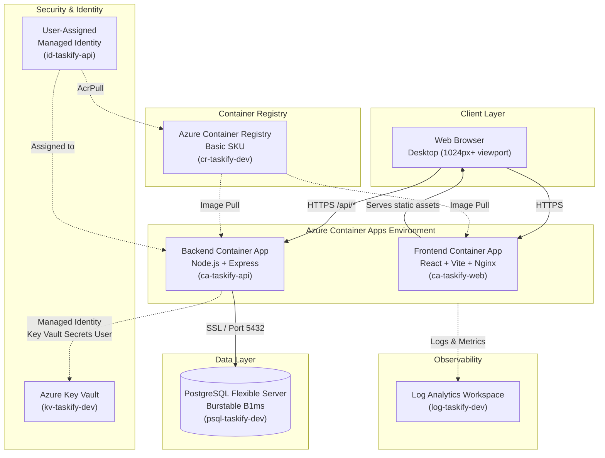

### Architecture Decisions

| Decision | Choice | Rationale |
|----------|--------|-----------|
| Hosting platform | Azure Container Apps | Serverless containers with built-in scaling, HTTPS ingress, and managed identity support. Simpler than AKS for a POC with two containers. |
| Frontend serving | Nginx in Container App | Static SPA assets served via Nginx. Decoupled from backend for independent scaling and deployment. |
| Database | PostgreSQL Flexible Server (Burstable B1ms) | Customer-specified technology. Burstable tier is cost-effective for POC workloads with intermittent usage. |
| Credential management | Key Vault + Managed Identity | Microsoft internal Azure constraint: no connection strings or access keys allowed. Managed identity provides keyless authentication to Key Vault. |
| IaC tooling | Bicep | Customer preference. Native Azure tooling with strong type safety and module support. |
| Drag-and-drop library | @hello-pangea/dnd | Well-maintained fork of react-beautiful-dnd with active community support and TypeScript types. |
| API architecture | RESTful Express.js | Simple, well-understood pattern. No GraphQL or tRPC needed for this scope. JavaScript per customer preference. |
| Container Registry SKU | Basic | Sufficient for POC. No geo-replication or advanced features needed. |
| Single resource group | One RG for all resources | Simplifies management for a POC. All resources share the same lifecycle. |
| Public ingress | Enabled for both Container Apps | POC requires browser access. Production would use private endpoints and a gateway. |

---

## 2. Workflow Pipeline

Taskify follows a standard request-response web application pattern. There are no background processing pipelines, message queues, or asynchronous workflows. All operations are synchronous REST API calls.

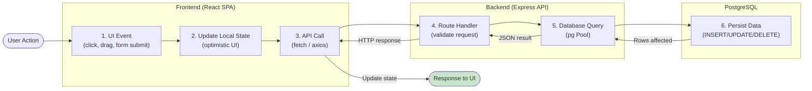

### Step Details

| Step | Purpose | Technology | Key Outputs |
|------|---------|------------|-------------|
| 1. UI Event | Capture user interaction (drag card, click button, submit form) | React event handlers, @hello-pangea/dnd | Event payload |
| 2. Update Local State | Optimistic update for responsive UI (e.g., move card immediately) | React useState/useReducer | Updated UI |
| 3. API Call | Send HTTP request to backend | fetch API with JSON body | HTTP request |
| 4. Route Handler | Validate request, extract parameters, apply business rules | Express.js router, middleware | Validated input |
| 5. Database Query | Execute parameterized SQL query | pg library Pool.query() | Query result |
| 6. Persist Data | Write or read data from PostgreSQL | PostgreSQL 16 | Committed transaction |

---

## 3. Request Lifecycle

### Task Status Change (Drag-and-Drop)

This is the most complex interaction in the application -- when a user drags a task card from one Kanban column to another.

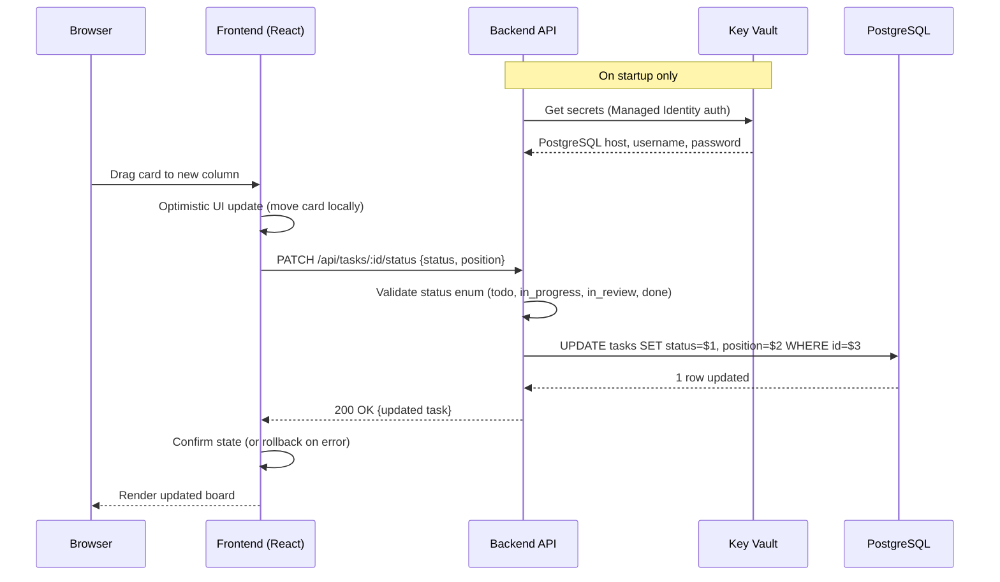

### Comment Creation

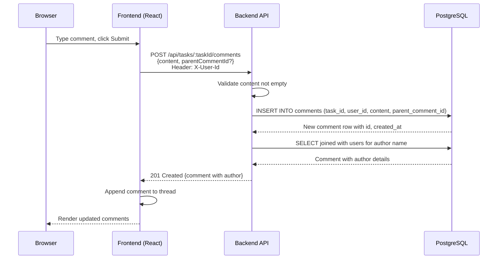

### Comment Edit/Delete (Ownership Check)

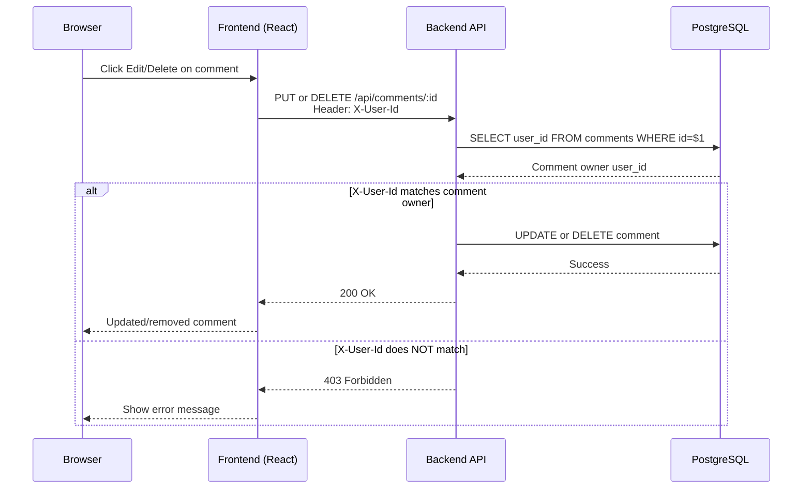

---

## 4. Azure Services Infrastructure

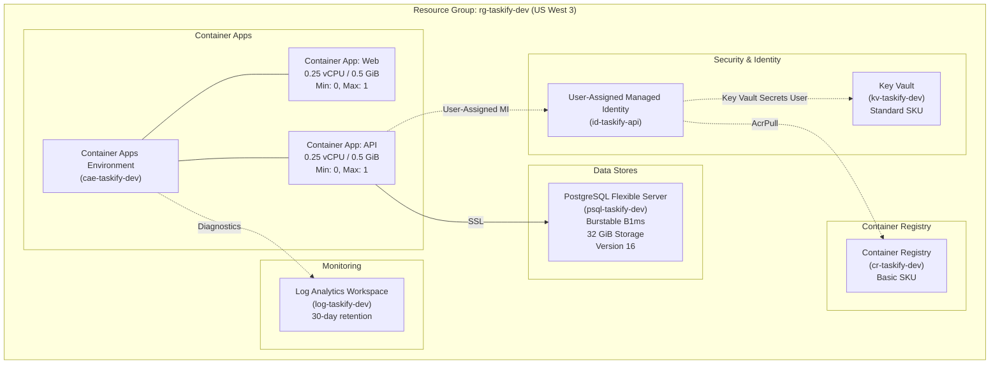

### Resource Summary

| Resource Type | Resource Name | SKU/Tier | Configuration |
|---------------|---------------|----------|---------------|
| Resource Group | rg-{uid}-taskify-dev | N/A | Location: US West 3 |
| Log Analytics Workspace | log-{uid}-taskify-dev | PerGB2018 | 30-day retention |
| User-Assigned Managed Identity | id-{uid}-taskify-api | N/A | Assigned to API Container App |
| Key Vault | kv-{uid}-taskify-dev | Standard | RBAC authorization, soft delete (7 days) |
| PostgreSQL Flexible Server | psql-{uid}-taskify-dev | Burstable B1ms | v16, 32 GiB storage, SSL enforced |
| Container Registry | cr{uid}taskifydev | Basic | Admin user disabled, managed identity pull |
| Container Apps Environment | cae-{uid}-taskify-dev | Consumption | Zone redundancy disabled |
| Container App (API) | ca-{uid}-taskify-api | Consumption | 0.25 vCPU, 0.5 GiB, port 3000, external ingress |
| Container App (Web) | ca-{uid}-taskify-web | Consumption | 0.25 vCPU, 0.5 GiB, port 80, external ingress |

**Note**: `{uid}` is a unique identifier assigned at deployment time to ensure globally unique resource names.

---

## 5. Data Storage Architecture

### PostgreSQL Schema

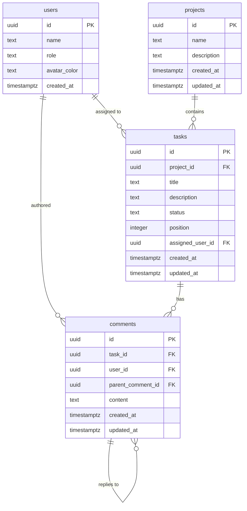

### Table Details

**users** - Five predefined team members (1 Product Manager, 4 Engineers). No dynamic user creation.

| Column | Type | Constraints | Purpose |
|--------|------|-------------|---------|
| id | UUID | PK, gen_random_uuid() | Unique identifier |
| name | TEXT | NOT NULL | Display name |
| role | TEXT | NOT NULL | product_manager or engineer |
| avatar_color | TEXT | NOT NULL | Hex color for avatar display |
| created_at | TIMESTAMPTZ | DEFAULT NOW() | Record timestamp |

**projects** - Kanban project boards. Three pre-seeded, with ability to create new ones.

| Column | Type | Constraints | Purpose |
|--------|------|-------------|---------|
| id | UUID | PK, gen_random_uuid() | Unique identifier |
| name | TEXT | NOT NULL | Project name |
| description | TEXT | NULLABLE | Project description |
| created_at | TIMESTAMPTZ | DEFAULT NOW() | Record timestamp |
| updated_at | TIMESTAMPTZ | DEFAULT NOW() | Last modification |

**tasks** - Kanban task cards within projects. Status determines column placement.

| Column | Type | Constraints | Purpose |
|--------|------|-------------|---------|
| id | UUID | PK, gen_random_uuid() | Unique identifier |
| project_id | UUID | FK -> projects(id) ON DELETE CASCADE | Parent project |
| title | TEXT | NOT NULL | Task title |
| description | TEXT | NULLABLE | Task details |
| status | TEXT | NOT NULL, DEFAULT 'todo' | Kanban column (todo, in_progress, in_review, done) |
| position | INTEGER | NOT NULL, DEFAULT 0 | Order within column |
| assigned_user_id | UUID | FK -> users(id) ON DELETE SET NULL | Assigned team member |
| created_at | TIMESTAMPTZ | DEFAULT NOW() | Record timestamp |
| updated_at | TIMESTAMPTZ | DEFAULT NOW() | Last modification |

**comments** - Threaded comments on task cards with ownership-based permissions.

| Column | Type | Constraints | Purpose |
|--------|------|-------------|---------|
| id | UUID | PK, gen_random_uuid() | Unique identifier |
| task_id | UUID | FK -> tasks(id) ON DELETE CASCADE | Parent task |
| user_id | UUID | FK -> users(id) ON DELETE CASCADE | Comment author |
| parent_comment_id | UUID | FK -> comments(id) ON DELETE CASCADE | Reply threading (nullable) |
| content | TEXT | NOT NULL | Comment text |
| created_at | TIMESTAMPTZ | DEFAULT NOW() | Record timestamp |
| updated_at | TIMESTAMPTZ | DEFAULT NOW() | Last modification |

### Indexes

| Index Name | Table | Column(s) | Purpose |
|------------|-------|-----------|---------|
| idx_tasks_project_id | tasks | project_id | Fast lookup of tasks by project |
| idx_tasks_assigned_user_id | tasks | assigned_user_id | Fast lookup of user's tasks |
| idx_tasks_status | tasks | status | Fast filtering by Kanban column |
| idx_comments_task_id | comments | task_id | Fast lookup of comments by task |
| idx_comments_user_id | comments | user_id | Fast lookup of comments by author |
| idx_comments_parent_comment_id | comments | parent_comment_id | Fast threading of replies |

### Seed Data

| Entity | Count | Distribution |
|--------|-------|-------------|
| Users | 5 | 1 Product Manager, 4 Engineers |
| Projects | 3 | Website Redesign, Mobile App MVP, API Integration |
| Tasks | 12 | 4 per project, distributed across all 4 Kanban columns |
| Comments | Sample | A few comments per task to demonstrate threading |

---

## 6. Service Dependencies

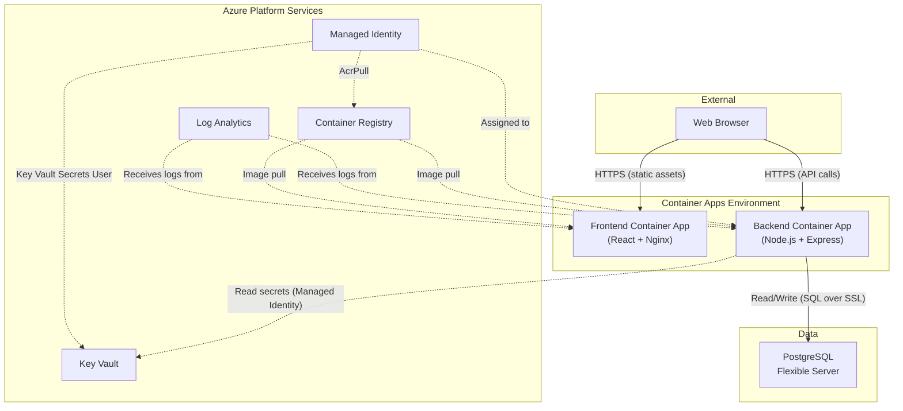

### Dependency Matrix

| Service | Depends On | Depended By |
|---------|------------|-------------|
| Resource Group | Subscription | All resources |
| Log Analytics Workspace | Resource Group | Container Apps Environment |
| User-Assigned Managed Identity | Resource Group | Key Vault (RBAC), Container Registry (RBAC), API Container App |
| Key Vault | Resource Group, Managed Identity (RBAC) | API Container App (secret retrieval) |
| PostgreSQL Flexible Server | Resource Group, Key Vault (stores password) | API Container App |
| Container Registry | Resource Group, Managed Identity (RBAC) | Both Container Apps (image source) |
| Container Apps Environment | Resource Group, Log Analytics | Both Container Apps |
| Container App (API) | Environment, Registry, Managed Identity, Key Vault, PostgreSQL | Frontend (API calls from browser) |
| Container App (Web) | Environment, Registry | Browser (serves static SPA) |

### Deployment Order

Resources must be deployed in the following order due to dependencies:

1. Resource Group
2. Log Analytics Workspace, User-Assigned Managed Identity (parallel)
3. Key Vault (needs Managed Identity for RBAC)
4. PostgreSQL Flexible Server (needs Key Vault for password storage)
5. Container Registry (needs Managed Identity for RBAC), Container Apps Environment (needs Log Analytics) (parallel)
6. Backend Container App (needs Environment, Registry, Identity, Key Vault, PostgreSQL)
7. Frontend Container App (needs Environment, Registry, and Backend FQDN for API URL)

---

## 7. Scaling & Autoscaling

As a POC, Taskify uses minimal scaling configuration. All Container Apps are configured to scale to zero when idle, which minimizes cost during development and testing.

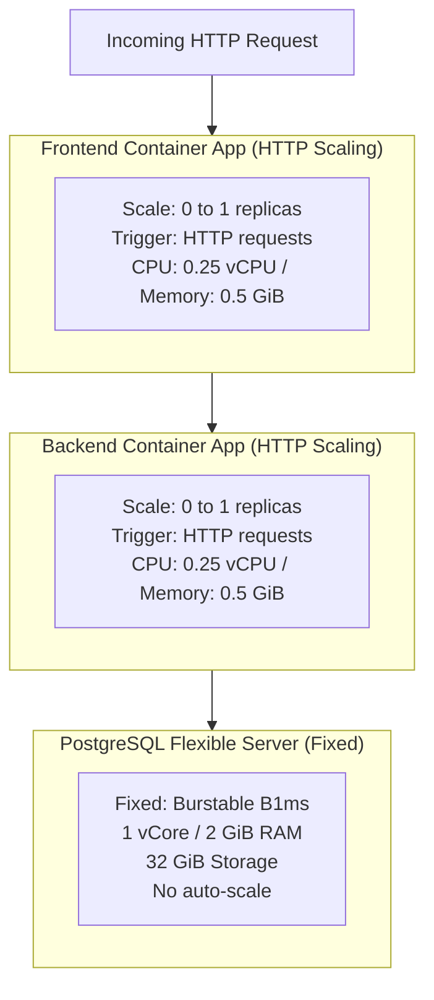

### Scaling Configuration

| Component | Min | Max | Trigger | Cold Start Time |
|-----------|-----|-----|---------|-----------------|
| Frontend Container App | 0 | 1 | HTTP requests | ~5-10 seconds (Nginx is lightweight) |
| Backend Container App | 0 | 1 | HTTP requests | ~10-15 seconds (Node.js startup + Key Vault secret fetch) |
| PostgreSQL Flexible Server | N/A (always on) | N/A | N/A | N/A |

### Production Scaling Considerations (Out of Scope)

For production readiness, the following changes would be recommended:

- **Increase max replicas** to 3-5 for both Container Apps to handle concurrent users
- **Set min replicas to 1** for the API to avoid cold start latency
- **Upgrade PostgreSQL** to General Purpose tier for consistent performance
- **Add connection pooling** (e.g., PgBouncer) for database connection management at scale
- **Enable zone redundancy** on Container Apps Environment for high availability

---

## 8. Error Handling & Retry Logic

As a prototype, Taskify implements basic error handling sufficient to demonstrate functionality and provide useful feedback to users. Production-grade error handling patterns are documented as recommendations.

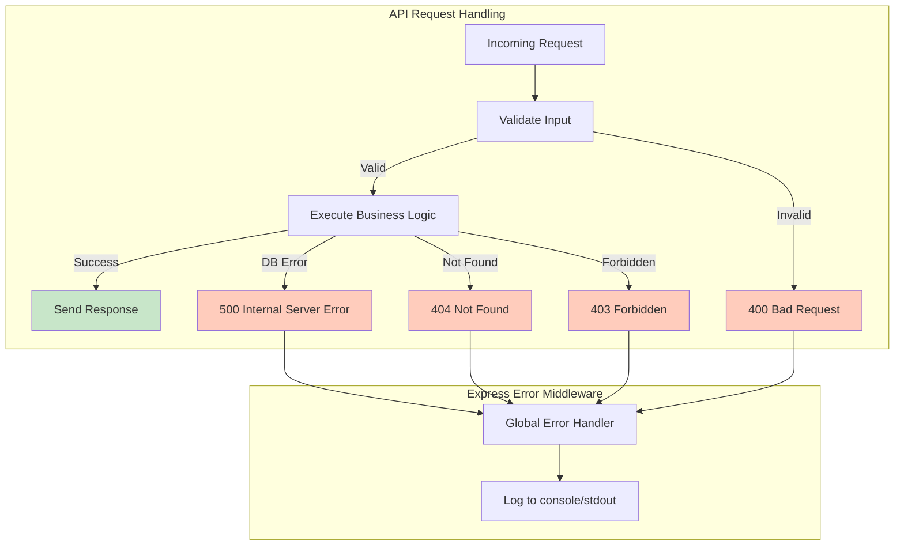

### Error Codes

| HTTP Status | Description | Scenario | Retryable |
|-------------|-------------|----------|-----------|
| 400 | Bad Request | Missing required fields, invalid status enum, empty comment content | No (client must fix input) |
| 403 | Forbidden | User attempting to edit/delete another user's comment | No (ownership violation) |
| 404 | Not Found | Task, project, comment, or user ID does not exist | No (resource does not exist) |
| 500 | Internal Server Error | PostgreSQL connection failure, unexpected runtime error | Yes (transient failures) |

### Frontend Error Handling

| Scenario | Behavior |
|----------|----------|
| API unreachable | Display error banner with retry option |
| 400/403/404 response | Display contextual error message to user |
| 500 response | Display generic error with retry option |
| Drag-and-drop fails (API error) | Revert card to original column (optimistic UI rollback) |
| Network timeout | Display connection error, prompt retry |

### Production Recommendations (Out of Scope)

- **Structured logging**: Use a logging library (e.g., winston or pino) with JSON output for Log Analytics ingestion
- **Correlation IDs**: Add request correlation headers for end-to-end tracing
- **Circuit breaker**: Implement circuit breaker pattern for PostgreSQL connection failures
- **Health checks**: Liveness and readiness probes on the Container Apps
- **Application Insights**: Integrate with Azure Application Insights for distributed tracing

---

## Technology Stack Summary

| Layer | Technology | Version/SKU |
|-------|------------|-------------|
| **Frontend** | React + TypeScript + Vite | React 18+, Vite 5+ |
| **UI Styling** | Tailwind CSS | 3.x |
| **Drag-and-Drop** | @hello-pangea/dnd | Latest |
| **Backend** | Node.js + Express.js (JavaScript) | Node 20 LTS, Express 4.x |
| **Database Client** | pg (node-postgres) | 8.x |
| **Database** | Azure Database for PostgreSQL Flexible Server | v16, Burstable B1ms |
| **Secret Management** | Azure Key Vault | Standard |
| **Identity** | User-Assigned Managed Identity + @azure/identity SDK | Latest |
| **Key Vault SDK** | @azure/keyvault-secrets | Latest |
| **Container Hosting** | Azure Container Apps | Consumption plan |
| **Container Registry** | Azure Container Registry | Basic |
| **Monitoring** | Azure Log Analytics | PerGB2018 |
| **IaC** | Bicep | Latest |
| **Web Server (Frontend)** | Nginx | Alpine-based |

---

## Security Architecture

### Identity and Access Management

All service-to-service authentication uses Azure Managed Identity. No connection strings or access keys are stored in application code or environment variables.

| Source | Target | Auth Method | Role/Permission |
|--------|--------|-------------|-----------------|
| API Container App | Key Vault | User-Assigned Managed Identity | Key Vault Secrets User |
| API Container App | PostgreSQL | Username/Password from Key Vault | PostgreSQL admin (stored as secrets) |
| Container Apps | Container Registry | User-Assigned Managed Identity | AcrPull |
| Browser | Frontend Container App | HTTPS (public) | Anonymous (no auth) |
| Browser | Backend Container App | HTTPS (public) | Anonymous (X-User-Id header for user context) |

### Secret Flow

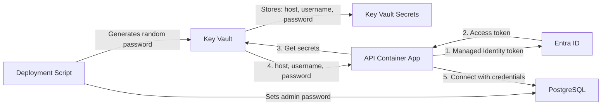

### Network Security (POC Configuration)

| Aspect | POC Setting | Production Recommendation |
|--------|-------------|---------------------------|
| Container Apps ingress | Public (external) | Private with Application Gateway or Front Door |
| PostgreSQL access | Public with Azure Services firewall rule | Private endpoint in VNet |
| Key Vault access | Public | Private endpoint in VNet |
| Container Registry access | Public | Private endpoint in VNet |
| CORS | Frontend origin only | Strict origin allowlist |
| TLS | Enforced (HTTPS for web, SSL for PostgreSQL) | Same, with custom domain certificates |

---

*Last updated: 2026-02-12*
