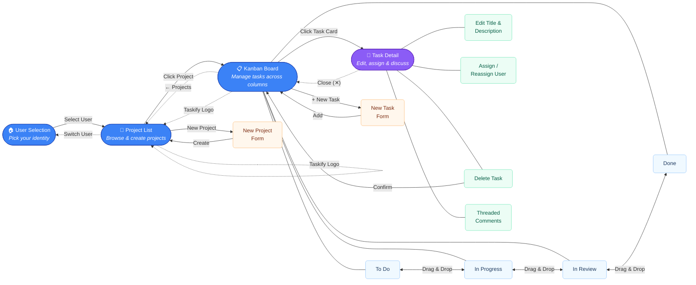

# Taskify — UI Navigation Flow

> **Auto-generated** from Playwright-validated navigation analysis of the Taskify web application.

## Application Overview

Taskify is a Kanban-style project management app with **state-based navigation** (no router).  
The UI consists of **3 views** and **1 modal overlay**, connected by user-driven actions.

---

## Navigation Flow Diagram

---

## Navigation Legend

| Color | Meaning | Examples |
|-------|---------|----------|
| 🔵 **Blue** | Main screens / views | User Selection, Project List, Kanban Board |
| 🟣 **Purple** | Modal overlays | Task Detail |
| 🔷 **Light Blue** | Kanban columns (sub-states) | To Do, In Progress, In Review, Done |
| 🟢 **Green** | In-modal actions | Edit, Assign, Delete, Comments |
| 🟠 **Orange** | Inline forms | New Project, New Task |
| **Solid arrow** →  | Forward navigation | Select User → Projects |
| **Dashed arrow** ⇢ | Back / return navigation | ← Projects, Switch User, Close |
| **Double arrow** ↔ | Bidirectional interaction | Drag & Drop between columns |

## Screen Details

### 1. User Selection (Landing)
- Displays 5 user cards with avatar, name, and role
- No header bar — standalone full-page view
- Selecting a user sets the active identity (no authentication)

### 2. Project List
- **Header**: Taskify logo (home link) · User avatar + name · Switch User
- Project cards in a responsive grid (1–3 columns)
- Each card shows: name, description, task count, done count
- "New Project" button toggles an inline creation form

### 3. Kanban Board
- **Header**: Same persistent header as Project List
- **Sub-header**: ← Projects back link · Project name · + New Task button
- **4 columns**: To Do → In Progress → In Review → Done
- Cards are **draggable** between columns (optimistic update)
- Clicking any card opens the Task Detail modal

### 4. Task Detail (Modal)
- Overlay on top of the Kanban Board (board remains visible behind scrim)
- **Status badge** · Title (click-to-edit) · Description (click-to-edit)
- **Assignee dropdown** with all team members
- **Actions**: Edit Task · Delete Task (with confirmation)
- **Threaded comments**: Add, reply (2 levels), edit (author), delete (author)
